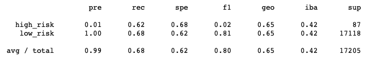
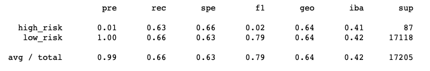
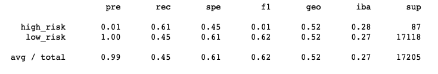
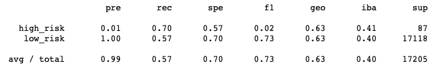
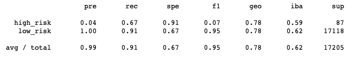
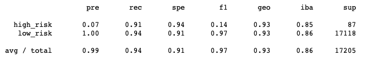

# **Overview of Analysis**
In this project, credit card data from LendingClub was used to design a machine learning model to assess and predict credit card risk. Multiple algorithms were used to assess and train the machine learning models as credit risk is unbalanced. THe alogirthms used to sample the data included RandomOverSampler, SMOTE, ClusterCentroids, and combination SMOTEEN. Next to reduce bias BalancedRandomForestClassifier and EasyEnsembleClassifer were used. All models were assesed for a balanced accuracy score and a classicifaction report generated for each.

# **Results**
Random Oversampling:
 * Balanced accuracy score: 64.97%
 * Precision score: 1% - high risk; 100% - low risk; 99% - average
 * Recall score: 62% - high risk; 68% - low risk; 68% - average

SMOTE Oversampling:
 * Balanced accuracy score: 64.44%
 * Precision score: 1% - high risk; 100% - low risk; 99% - average
 * Recall score: 63% - high risk; 66% - low risk; 66% - average

Undersampling:
 * Balanced accuracy score: 64.44%
 * Precision score: 1% - high risk; 100% - low risk; 99% - average
 * Recall score: 61% - high risk; 45% - low risk; 45% - average

Combination:
 * Balanced accuracy score: 63.76%
 * Precision score: 1% - high risk; 100%  -low risk; 99% - average
 * Recall score: 70% - high risk; 57% - low risk; 57% - average

Random Forest:
 * Balanced accuracy score: 78.78%
 * Precision score: 4% - high risk; 100% - low risk; 99% - average
 * Recall score: 67% - high risk; 91% - low risk; 91% - average

Easy Ensemble:
 * Balanced accuracy score: 92.5%
 * Precision score: 7% - high risk; 100% - low risk; 99% - average
 * Recall score: 91% - high risk; 94% - low risk; 94% - average

# **Summary**
Of all the six models test, the ensemble classifiers were the most effective models. The Random Forest and Easy Ensemble model had the highest balanced accuracy scores, with similar precision scores across risk levels. The Easy Ensemble outperformed the Random Forest model with higher recall scores. The Easy Ensemble model is recommended as it was the model with the highest accuracy score. While the Easy Ensemble method had a high recall score for both low and high risk loans (accurately predicted risk levels from the predicted results) but very low precision rate for high risk loans. This means the Easy Ensemble method may not be accurately predicting the number of high risk loans from real loan applications resulting in higher risk as some high risk loans may not be classified as high risk.
